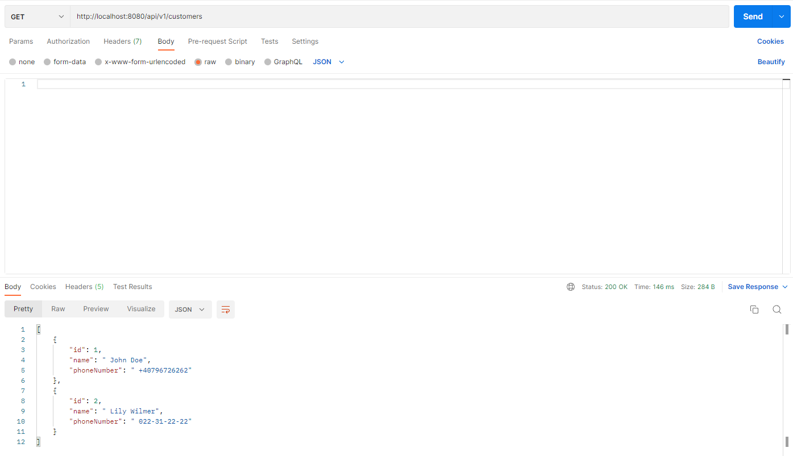
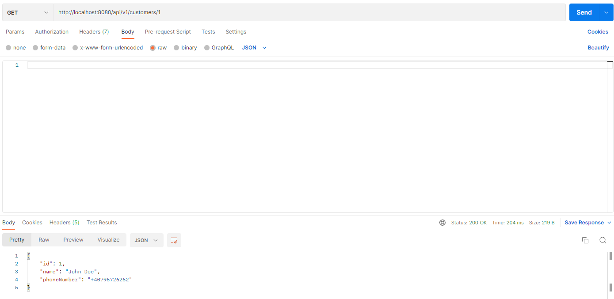

# Customer Management API

## Solution

This solution implements a customer management web server using Java and Spring Boot. The customer data is stored in a
simple text file, `customers.txt`, where each line represents a customer in the format `id, name, phoneNumber
(e.g., 1, "John Doe", "1234567890")`. The application provides a **CRUD** (Create, Read, Update, Delete) RESTful API for
managing customer data.

## Description

The application supports the following operations:

1. **Retrieve all customers**
    - **Endpoint:** GET /customers
    - **Description:** Returns a list of all customers in json format.

2. **Retrieve customer by ID**
    - **Endpoint:** GET /customers/{id}
    - **Description:** Accepts a numeric customer ID in the URL and returns the data of the customer with the
      specified ID.

3. **Update customer name**
    - **Endpoint:** PUT /customers
    - **Description:** Accepts a numeric customer ID and a new name in the request body. Updates the name of the
      customer with the specified ID.

4. **Add a new customer**
    - **Endpoint:** POST /customers
    - **Description:** Accepts a numeric customer ID, a name, and a phone number in the request body. Adds a new
      customer with the specified ID. The ID of each customer should be unique.

5. **Delete a customer**
    - **Endpoint:** DELETE /customers/{id}
    - **Description:** Accepts a numeric customer ID in the URL and deletes the customer.

## Getting Started

### Prerequisites

- **Java 11 or higher**
- **Maven**

### Installation

**1. Clone the repository:** `git clone https://github.com/nicusemitar/customer-management-api`

**2. Navigate to the project directory:** `cd customer-management-api`

**3. Build the project:** `mvn clean install`

**4. Set the port number:** In the `application.properties` file to
set the desired port number for the application, by default it is `8080`

**4. Run the application:** `mvn spring-boot:run`

### Accessing the API

After starting the application, you can access the API at`http://localhost:${server.port}`

## Swagger Documentation

This application uses Swagger to document and test the API endpoints. Swagger provides a user-friendly
interface for interacting with the API and viewing the available endpoints and their details.

- **Swagger UI:** Accessible at swagger-ui/index.html after starting the application.
- **Accessing Swagger UI:** You can access the Swagger UI at http://localhost:8080/swagger-ui.html.

## Future Improvements

- **Error / Exception Handling with advice:** Improve error handling and return more informative error messages to the clients.
- **Improve jUnit tests:** There is a need to add more unit tests in order to cover more existing code and functionality.
- **Docker Support:** To configure a Docker image.

## Postman Smoke Tests

- **Included are screens with smoke testing the API endpoints using Postman.**

- Retrieve all customers
  

- Retrieve customer by ID
  

- Create a new customer
  

- Update the name of an existing customer
  

- Delete customer by ID
  